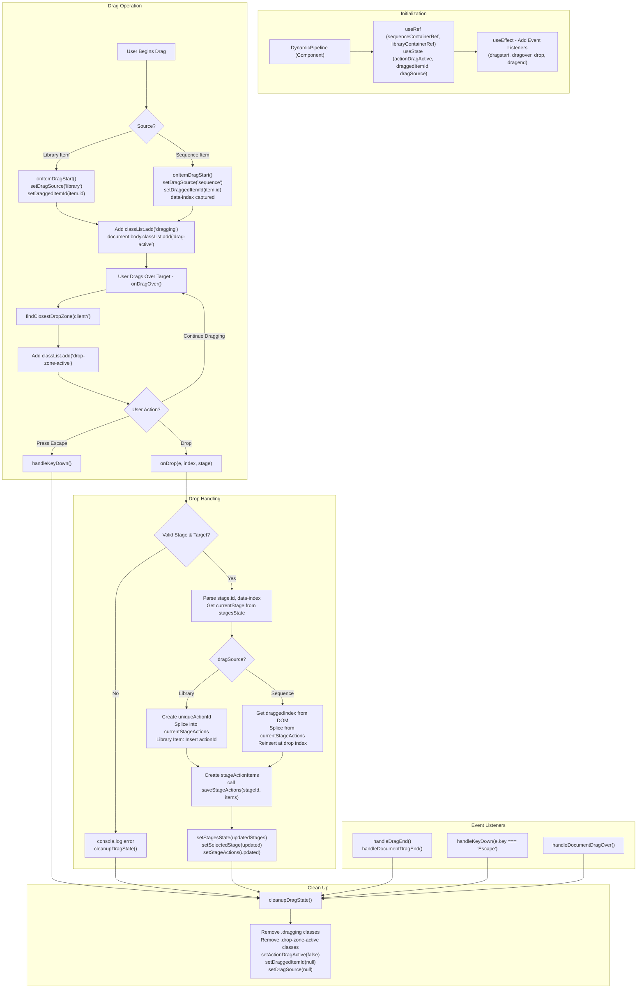
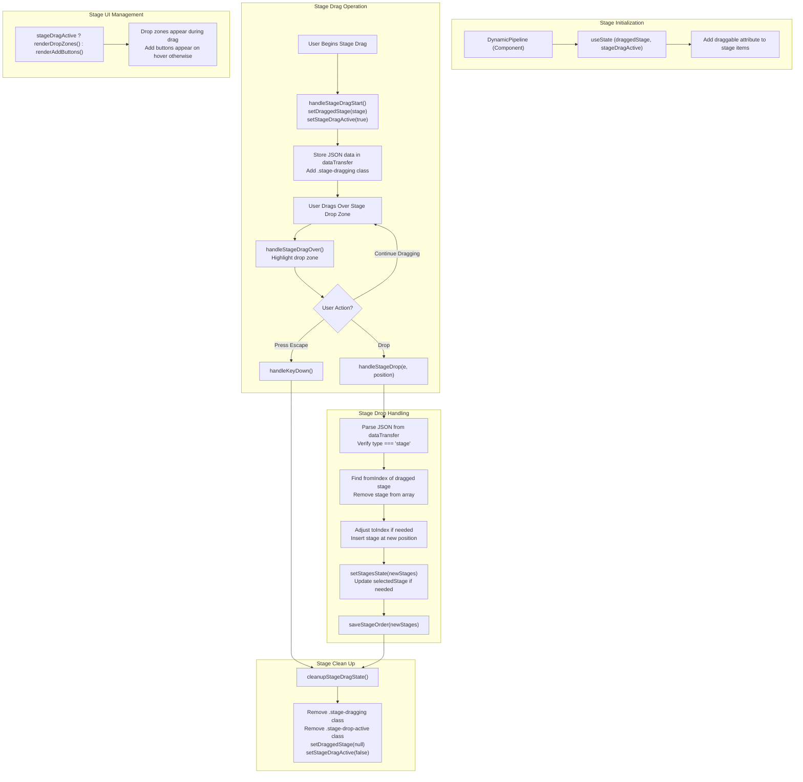

# Pipeline Builder: Comprehensive Drag and Drop System Documentation

## Overview

The drag and drop system in the Pipeline Builder component enables users to:
1. Drag actions from a library into stage automation sequences
2. Reorder actions within a sequence (stage automation)
3. Remove actions via a trash icon
4. Drag and drop stages to reorder the pipeline flow
5. Visualize stage ordering with dynamic drop zones

This document explains the architecture, event flow, and key concepts for both action and stage drag-and-drop operations.

## Key Components

### Action Management Components
- **Library Container**: Source of automation actions that can be dragged into sequences. Populated with entries from the database table tblFeature
- **Stage Containers**: Target containers for actions, organized by pipeline stage
- **Action Drop Zones**: Invisible areas that become visible during action drag operations, indicating where actions can be dropped
- **Draggable Action Items**: Both library items and sequence items can be dragged

### Stage Management Components
- **Stage List Container**: Contains all pipeline stages in the left sidebar
- **Stage Items**: Individual stages that can be dragged to reorder
- **Stage Drop Zones**: Areas between stages that appear during stage drag operations
- **Stage Drag Handle**: Visual indicator that appears on hover to show stages can be dragged

## State Management

### Action Drag and Drop State
- `actionDragActive`: Boolean indicating if an action drag operation is in progress
- `draggedItemId`: ID of the currently dragged action
- `dragSource`: Origin of the dragged action ('library' or 'sequence')
- `stagesState`: Current state of all pipeline stages and their actions
- `selectedStage`: Currently selected stage
- `stageActions`: Actions belonging to the selected stage

### Stage Drag and Drop State
- `draggedStage`: The stage currently being dragged
- `stageDragActive`: Boolean indicating if a stage drag operation is in progress
- `stagesState`: Current ordering of pipeline stages (shared with action state)

## Event Flow

### Action Drag and Drop Flow
1. **Drag Start**
   - Action item receives `onDragStart` event
   - System captures item ID and source
   - Visual styling applied to dragged element
   - Drag data is set in the dataTransfer object

2. **Drag Over**
   - Action drop zones handle `onDragOver` event
   - Prevent default to allow dropping
   - Find and highlight the closest drop zone

3. **Drop**
   - Target drop zone receives `onDrop` event
   - System identifies target stage and position
   - Different logic runs based on drag source:
     - From library: Creates new action in sequence
     - From sequence: Reorders existing action
   - Changes are saved via `saveStageActions`

4. **Drag End**
   - `cleanupDragState` resets all visual states
   - Event listeners for abort/escape ensure proper cleanup

### Stage Drag and Drop Flow
1. **Stage Drag Start**
   - Stage receives `handleStageDragStart` event
   - `draggedStage` state is set with the stage being moved
   - `stageDragActive` is set to true
   - Visual styling applied to dragged stage
   - Drag data includes both stage ID and type identifier

2. **Stage Drag Over**
   - Stage drop zones appear between all stages
   - `handleStageDragOver` highlights the active drop zone
   - "Add stage" buttons are temporarily hidden

3. **Stage Drop**
   - `handleStageDrop` processes the drop event
   - JSON data is parsed from dataTransfer
   - Stage is removed from original position
   - Stage is inserted at the new position
   - States are updated to reflect new order
   - Changes are saved via `saveStageOrder`

4. **Stage Drag End**
   - `cleanupStageDragState` resets visual states
   - Drop zones are hidden
   - "Add stage" buttons reappear on hover

## Implementation Details

### Dual Event Systems

The component uses both React event handlers and DOM event listeners:
- React handlers: For simple drag operations directly on elements
- DOM listeners: For more complex behavior and edge cases

### Unique ID Generation

When dragging from library to sequence, each action gets a unique ID:
```javascript
const uniqueActionId = `${libraryItem!.id}_${generateUUID()}`;
```

### Data Attributes

DOM elements use data attributes to store crucial information:
- `data-id`: Action identifier
- `data-index`: Position within sequence
- `data-stage-id`: Stage the action or drop zone belongs to

### Visual Feedback

CSS classes provide visual feedback during operations:
- **Action Dragging**:
  - `.dragging`: Applied to the action being dragged
  - `.drop-zone-active`: Highlights active action drop zones
  - `.empty-drop-zone-active`: Special styling for empty containers

- **Stage Dragging**:
  - `.stage-dragging`: Applied to the stage being dragged
  - `.stage-drop-active`: Highlights active stage drop zones
  - `.drop-zone-stage`: Base class for stage drop zones

## Switching Between UI States

The system intelligently manages the UI based on the current drag operation:

1. **Default State**: 
   - "Add stage" buttons appear on hover between stages
   - Action drop zones are invisible

2. **Action Dragging State**:
   - Action drop zones become visible
   - Drop targets highlight when dragged over

3. **Stage Dragging State**:
   - "Add stage" buttons are hidden
   - Stage drop zones appear between all stages
   - Active drop zone is highlighted

## Error Handling

The system includes comprehensive error checking:
- Validates stage existence
- Confirms drop targets are valid
- Handles cases where dragged items don't exist
- Manages drag cancellation and aborts
- Uses try/catch blocks when parsing JSON data from stage drops

## Special Cases

- **Empty Stages**: Special drop zone that expands when dragged over
- **Item Removal**: Delete button triggers action removal with proper state updates
- **Escape Key**: Cancels both action and stage drag operations
- **Out-of-bounds Drops**: System cleans up state even when drops occur outside valid zones
- **Index Adjustment**: When dropping a stage, the target index is adjusted if moving forward in the list

## API Integration

- **Action Order Changes**: Persisted via `saveStageActions(stageId, actions)`
- **Stage Order Changes**: Persisted via `saveStageOrder(stages)` 
- Both functions handle the transformation of data for API calls and error handling

## Technical Notes

- Uses React's `useRef` to maintain DOM references
- Leverages `useEffect` to set up and clean up event listeners
- Creates cloned elements for custom drag images
- Uses data transformation to ensure consistent data structure
- JSON serialization for complex drag data (used in stage dragging)

## Mermaid Flowchart: Action Drag and Drop



## Mermaid Flowchart: Stage Drag and Drop



## Integration Between Systems

The action and stage drag systems work independently but share some common elements:
- Both use the same `stagesState` data structure
- Document-level event handlers handle cancellation for both systems
- Visual states are kept separate to avoid interference
- Combined cleanup ensures consistent UI state after any drag operation

This dual-system architecture creates a cohesive user experience while keeping the code maintainable and concerns properly separated.